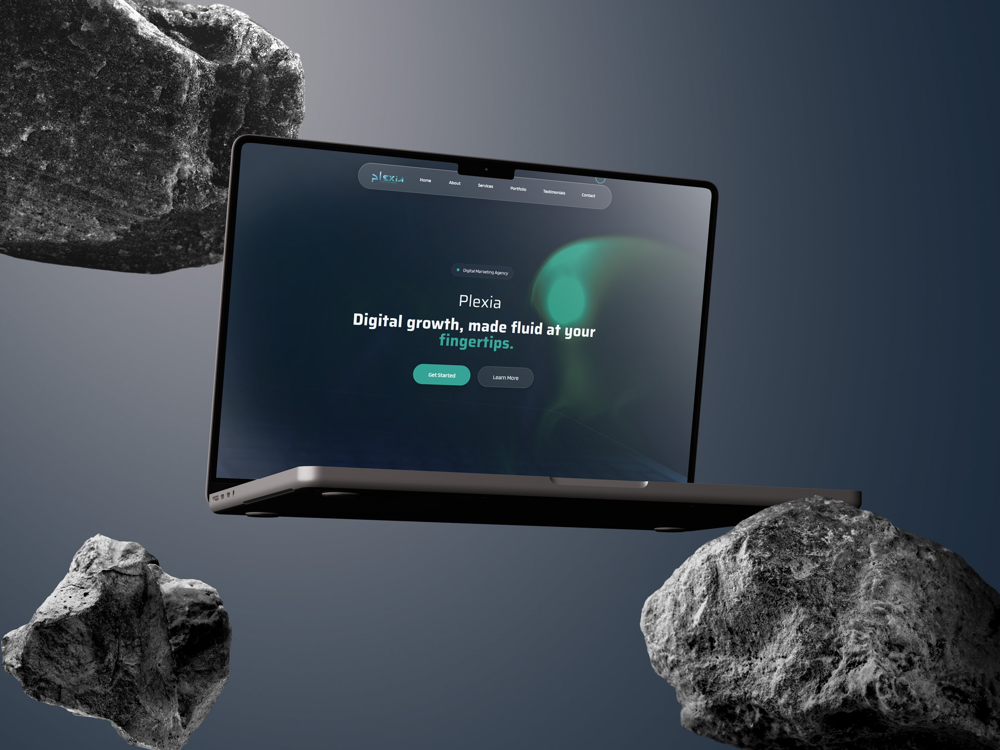

<div align="center">
  
  
  # Plexia
  ### Digital Marketing Excellence
  
  *Modern digital marketing landing page with interactive fluid animations and glassmorphism design*
  
  
  
  
  
  
  
</div>

## ✨ Features

- **🌊 Interactive Fluid Animations** - WebGL-powered liquid ether with mouse interaction
- **🔮 Glassmorphism Design** - Modern glass-style UI components with backdrop blur
- **📱 Fully Responsive** - Optimized for desktop, tablet, and mobile devices
- **🎯 Modern Services Showcase** - Bento grid layout for digital marketing services
- **⚡ High Performance** - Optimized animations and smooth 60fps interactions

## 🚀 Quick Start

```bash
# Clone repository
git clone https://github.com/AbdeljalilRajli/Plexia.git

# Install dependencies
cd Plexia && npm install

# Start development server
npm run dev
```

## 🎨 Color Palette

```css
--primary: #33A395    /* Teal */
--secondary: #A1D3AC  /* Light Green */
--accent: #66C7B8     /* Medium Teal */
```

## 🛠️ Built With

- **React 18** - Modern UI framework
- **Vite** - Fast build tool
- **Tailwind CSS** - Utility-first styling
- **Three.js** - 3D graphics and WebGL
- **Framer Motion** - Smooth animations

## 📄 License

MIT License - see [LICENSE](LICENSE) for details.

---

<div align="center">
  <p><strong>Built with ❤️ for Digital Marketing Excellence</strong></p>
  
  [🌐 Live Demo](https://your-demo-link.com) • [🐛 Report Bug](https://github.com/AbdeljalilRajli/Plexia/issues) • [✨ Request Feature](https://github.com/AbdeljalilRajli/Plexia/issues)
</div>
